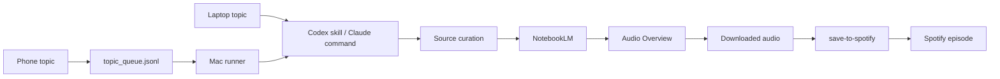

# Research Podcast Factory

A local-first workflow for turning a short topic into a serious research podcast.

The aim is simple:

```text
topic
  -> source curation
  -> NotebookLM notebook
  -> Audio Overview
  -> Spotify episode
```

This repo packages the workflow I built around Codex, Claude Code, NotebookLM, and `save-to-spotify`. It is for people who want the same loop: capture a question, gather sources worth trusting, generate a NotebookLM Audio Overview, and put the finished episode where they already listen.

## What This Includes

- A Codex skill: `$research-podcast-factory`
- Claude Code slash commands:
  - `/research-notebook-factory`
  - `/process-podcasts`
  - `/notebook-podcast-factory`
- A phone-friendly queue script
- A tiny webhook for iOS Shortcuts
- A preflight checker for the local Mac setup
- Smoke tests for the portable pieces

## What This Does Not Hide

Consumer NotebookLM does not currently behave like a normal public cloud API. The personal NotebookLM path depends on a logged-in browser or MCP runner on a Mac.

That means the practical paths are:

1. **Local NotebookLM path**
   - Best if you want real NotebookLM Audio Overviews.
   - Requires your Mac to be awake and authenticated.

2. **NotebookLM Enterprise path**
   - Best if you have Google Cloud NotebookLM Enterprise access.
   - Can be moved into cloud infrastructure.

3. **NotebookLM-like cloud path**
   - Best if you want phone-to-Spotify with no Mac.
   - Replaces NotebookLM with search, source ingestion, synthesis, TTS, and publishing.

This repo starts with the first path because it preserves the actual NotebookLM output.

## Install

```bash
git clone https://github.com/romanlicursi/research-podcast-factory.git
cd research-podcast-factory
./scripts/install.sh
python3 tests/smoke_test.py
python3 scripts/rpf_preflight.py
```

The installer copies:

- `codex-skill/research-podcast-factory` into `~/.codex/skills/research-podcast-factory`
- `claude-commands/*.md` into `~/.claude/commands`

It also creates:

- `~/Documents/NotebookLM-Pipeline`
- `~/Downloads/notebooklm-audio`

## Use From Codex

```text
Use $research-podcast-factory: Simone Weil's Christianity for a skeptical agnostic
```

The skill remembers the standards:

- high-quality sources
- no institution-only papers
- source hierarchy and caveats
- NotebookLM prompt pack
- state tracking
- Spotify delivery

## Use From Claude Code

Run the full workflow:

```text
/notebook-podcast-factory Dostoevsky's answer to atheism and old Christianity
```

Curate only:

```text
/research-notebook-factory --sources-only Dostoevsky's answer to atheism and old Christianity
```

Process ready audio:

```text
/process-podcasts
```

## Phone Capture

The smallest phone input should be one line:

```text
podcast: Dostoevsky and the problem of evil
```

For a local test:

```bash
python3 scripts/queue_topic.py "Dostoevsky and the problem of evil"
python3 scripts/queue_worker.py --next
```

For an iOS Shortcut, run:

```bash
python3 scripts/topic_webhook.py --host 0.0.0.0 --port 8765
```

Then create a Shortcut that POSTs JSON to:

```text
http://YOUR_MAC_LAN_IP:8765/topic
```

Example body:

```json
{
  "topic": "Simone Weil's Christianity for a skeptical agnostic",
  "mode": "local-notebooklm"
}
```

See [docs/iphone-shortcut.md](docs/iphone-shortcut.md).

## State

The workflow uses:

```text
~/Documents/NotebookLM-Pipeline/state.json
~/Documents/NotebookLM-Pipeline/topic_queue.jsonl
~/Downloads/notebooklm-audio
```

`state.json` is what keeps the pipeline resumable. It stores notebook IDs, source URLs, prompt packs, audio status, local audio paths, fingerprints, and Spotify episode IDs.

## Spotify

Install and authenticate `save-to-spotify`, then check:

```bash
save-to-spotify auth status --json
save-to-spotify shows --json
```

The workflow uses JSON output so it can store episode IDs and avoid duplicate uploads.

## Local Checks

Run:

```bash
python3 tests/smoke_test.py
python3 scripts/rpf_preflight.py
```

The smoke test checks queueing and webhook capture. The preflight check verifies local tools, state, folders, and Spotify auth.

## Architecture



## Why It Is Built This Way

NotebookLM is very good as a reading room. Claude Code is good as a tool runner. Codex is good at turning repeated work into local skills and scripts. `save-to-spotify` is the final publishing pipe.

The workflow keeps each tool doing the part it is best at.
