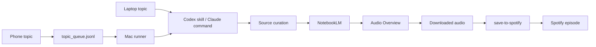

# Research Podcast Factory

A local-first workflow for turning a short topic into a serious research podcast.

The aim is simple:

```text
topic
  -> source curation
  -> NotebookLM notebook
  -> Audio Overview
  -> Spotify episode
```

This repo packages a workflow for people who want the same loop: capture a question, gather sources worth trusting, generate a NotebookLM Audio Overview, and put the finished episode where they already listen.

Codex and Claude Code were used to build and operate the first version. They are not the product. The product is the workflow:

```text
phone or laptop topic
  -> queue
  -> Mac runner
  -> source curation
  -> NotebookLM
  -> save-to-spotify
  -> Spotify
```

## What This Includes

- A Codex skill for topic intake and source standards: `$research-podcast-factory`
- Claude Code slash commands for people who want to operate the local Mac runner through Claude Code:
  - `/research-notebook-factory`
  - `/process-podcasts`
  - `/notebook-podcast-factory`
- A phone-friendly queue script
- A tiny webhook for iOS Shortcuts
- A preflight checker for the local Mac setup
- Smoke tests for the portable pieces

## The Actual Stack

These are the runtime pieces:

- **Phone capture:** an iOS Shortcut sends one topic to your Mac.
- **Queue:** `topic_queue.jsonl` stores incoming topics.
- **Mac runner:** your Mac reads the queue and runs the local NotebookLM workflow.
- **Source curation:** the command builds a compact source pack and prompt pack.
- **NotebookLM:** holds sources and generates the Audio Overview.
- **Save to Spotify:** Spotify's CLI for uploading personal audio files as Spotify episodes.
- **Spotify:** where the finished episode appears.

These are build/operator tools:

- **Claude Code:** useful for running the slash commands and NotebookLM MCP flow.
- **Codex:** useful for packaging the repeated workflow as a reusable skill and maintaining this repo.

You can replace the operator layer. The workflow shape matters more than which agent runs it.

## What This Does Not Hide

Consumer NotebookLM does not currently behave like a normal public cloud API. The personal NotebookLM path depends on a logged-in browser or MCP runner on a Mac.

That means the practical paths are:

1. **Local NotebookLM path**
   - Best if you want real NotebookLM Audio Overviews.
   - Requires your Mac to be awake and authenticated.

2. **NotebookLM Enterprise path**
   - Best if you have Google Cloud NotebookLM Enterprise access.
   - Can be moved into cloud infrastructure.

3. **NotebookLM-like cloud path**
   - Best if you want phone-to-Spotify with no Mac.
   - Replaces NotebookLM with search, source ingestion, synthesis, TTS, and publishing.

This repo starts with the first path because it preserves the actual NotebookLM output.

## Install

```bash
git clone https://github.com/romanlicursi/research-podcast-factory.git
cd research-podcast-factory
./scripts/install.sh
python3 tests/smoke_test.py
python3 scripts/rpf_preflight.py
```

The installer copies:

- `codex-skill/research-podcast-factory` into `~/.codex/skills/research-podcast-factory`
- `claude-commands/*.md` into `~/.claude/commands`

It also creates:

- `~/Documents/NotebookLM-Pipeline`
- `~/Downloads/notebooklm-audio`

## Use From Codex

```text
Use $research-podcast-factory: Simone Weil's Christianity for a skeptical agnostic
```

The skill remembers the standards:

- high-quality sources
- no institution-only papers
- source hierarchy and caveats
- NotebookLM prompt pack
- state tracking
- Spotify delivery

## Use From Claude Code

Run the full workflow:

```text
/notebook-podcast-factory Dostoevsky's answer to atheism and old Christianity
```

Curate only:

```text
/research-notebook-factory --sources-only Dostoevsky's answer to atheism and old Christianity
```

Process ready audio:

```text
/process-podcasts
```

## Phone Workflow

The phone workflow is:

```text
iPhone Shortcut
  -> POST /topic on your Mac
  -> topic_queue.jsonl
  -> queue_worker.py prints the next runner command
  -> local Mac runner creates/processes the NotebookLM podcast
```

The smallest phone input is one line:

```text
podcast: Dostoevsky and the problem of evil
```

For a local test:

```bash
python3 scripts/queue_topic.py "Dostoevsky and the problem of evil"
python3 scripts/queue_worker.py --next
```

To receive phone topics, run this on your Mac:

```bash
python3 scripts/topic_webhook.py --host 0.0.0.0 --port 8765
```

Then create an iOS Shortcut that POSTs JSON to:

```text
http://YOUR_MAC_LAN_IP:8765/topic
```

Example body:

```json
{
  "topic": "Simone Weil's Christianity for a skeptical agnostic",
  "mode": "local-notebooklm"
}
```

See [docs/iphone-shortcut.md](docs/iphone-shortcut.md).

After sending a topic from your phone, check the queue:

```bash
python3 scripts/queue_worker.py --next
```

That prints the next command to run in Claude Code, for example:

```text
/notebook-podcast-factory "Dostoevsky and the problem of evil" --audience "Roman, curious skeptical listener"
```

The current repo does not pretend your phone can directly drive consumer NotebookLM in the cloud. Your phone captures the topic; your Mac performs the NotebookLM work.

## State

The workflow uses:

```text
~/Documents/NotebookLM-Pipeline/state.json
~/Documents/NotebookLM-Pipeline/topic_queue.jsonl
~/Downloads/notebooklm-audio
```

`state.json` is what keeps the pipeline resumable. It stores notebook IDs, source URLs, prompt packs, audio status, local audio paths, fingerprints, and Spotify episode IDs.

## Spotify

This repo uses Spotify's [save-to-spotify](https://github.com/spotify/save-to-spotify) CLI.

`save-to-spotify` is a command-line tool from Spotify for saving personal audio content to Spotify. It does not generate audio. It takes an existing `.mp3`, `.m4a`, `.wav`, or `.ogg` file and creates an episode in a Spotify show.

In this workflow, NotebookLM creates the audio. `save-to-spotify` uploads the finished file.

Install and authenticate it, then check:

```bash
save-to-spotify auth status --json
save-to-spotify shows --json
```

The workflow uses JSON output so it can store episode IDs and avoid duplicate uploads.

## Local Checks

Run:

```bash
python3 tests/smoke_test.py
python3 scripts/rpf_preflight.py
```

The smoke test checks queueing and webhook capture. The preflight check verifies local tools, state, folders, and Spotify auth.

## Architecture



## Why It Is Built This Way

NotebookLM is the reading room and audio generator. The phone/webhook/queue layer is the intake system. The Mac runner handles the local browser-dependent work. `save-to-spotify` publishes the finished audio file to Spotify.

Claude Code and Codex are useful ways to operate and maintain the workflow, but they are not the runtime stack a user needs to understand first.
