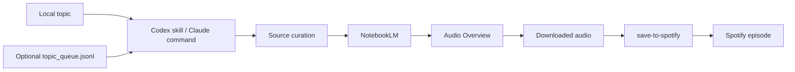

# Research Podcast Factory

A local workflow for turning a short topic into a serious research podcast.

The aim is simple:

```text
topic
  -> source curation
  -> NotebookLM notebook
  -> Audio Overview
  -> Spotify episode
```

This repo packages a desktop workflow for people who want the same loop: start with a question, gather sources worth trusting, generate a NotebookLM Audio Overview, and put the finished episode where they already listen.

Codex and Claude Code were used to build and operate the first version. They are not the product. The product is the workflow:

```text
topic on your Mac
  -> source curation
  -> NotebookLM
  -> downloaded audio file
  -> save-to-spotify
  -> Spotify
```

## What This Includes

- A Codex skill for topic intake and source standards: `$research-podcast-factory`
- Claude Code slash commands for operating the local workflow:
  - `/research-notebook-factory`
  - `/process-podcasts`
  - `/notebook-podcast-factory`
- A local topic queue script
- A preflight checker for the local Mac setup
- Smoke tests for the portable pieces
- Notes on Spotify's `save-to-spotify` CLI

## The Actual Stack

These are the runtime pieces:

- **Local topic input:** type or paste the topic on your Mac.
- **Source curation:** the command builds a compact source pack and prompt pack.
- **NotebookLM:** holds sources and generates the Audio Overview.
- **Local audio file:** the downloaded NotebookLM `.m4a`.
- **Save to Spotify:** Spotify's CLI for uploading personal audio files as Spotify episodes.
- **Spotify:** where the finished episode appears.

These are build/operator tools:

- **Claude Code:** useful for running the slash commands and NotebookLM MCP flow.
- **Codex:** useful for packaging the repeated workflow as a reusable skill and maintaining this repo.

You can replace the operator layer. The workflow shape matters more than which agent runs it.

## What This Does Not Hide

Consumer NotebookLM does not currently behave like a normal public API. The personal NotebookLM path depends on a logged-in browser or MCP runner on a Mac.

This repo starts with the local path because it preserves the actual NotebookLM output.

## Install

```bash
git clone https://github.com/romanlicursi/research-podcast-factory.git
cd research-podcast-factory
./scripts/install.sh
python3 tests/smoke_test.py
python3 scripts/rpf_preflight.py
```

The installer copies:

- `codex-skill/research-podcast-factory` into `~/.codex/skills/research-podcast-factory`
- `claude-commands/*.md` into `~/.claude/commands`

It also creates:

- `~/Documents/NotebookLM-Pipeline`
- `~/Downloads/notebooklm-audio`

## Use From Codex

```text
Use $research-podcast-factory: Simone Weil's Christianity for a skeptical agnostic
```

The skill remembers the standards:

- high-quality sources
- no institution-only papers
- source hierarchy and caveats
- NotebookLM prompt pack
- state tracking
- Spotify delivery

## Use From Claude Code

Run the full workflow:

```text
/notebook-podcast-factory Dostoevsky's answer to atheism and old Christianity
```

Curate only:

```text
/research-notebook-factory --sources-only Dostoevsky's answer to atheism and old Christianity
```

Process ready audio:

```text
/process-podcasts
```

## Local Queue

The queue is optional. It is useful when you want to jot down several topics and process them later.

Add a topic:

```bash
python3 scripts/queue_topic.py "Dostoevsky and the problem of evil"
```

Show the next queued command:

```bash
python3 scripts/queue_worker.py --next
```

That prints a command to run in Claude Code, for example:

```text
/notebook-podcast-factory "Dostoevsky and the problem of evil" --audience "Roman, curious skeptical listener"
```

## State

The workflow uses:

```text
~/Documents/NotebookLM-Pipeline/state.json
~/Documents/NotebookLM-Pipeline/topic_queue.jsonl
~/Downloads/notebooklm-audio
```

`state.json` is what keeps the pipeline resumable. It stores notebook IDs, source URLs, prompt packs, audio status, local audio paths, fingerprints, and Spotify episode IDs.

## Spotify

This repo uses Spotify's [save-to-spotify](https://github.com/spotify/save-to-spotify) CLI.

`save-to-spotify` is a command-line tool from Spotify for saving personal audio content to Spotify. It does not generate audio. It takes an existing `.mp3`, `.m4a`, `.wav`, or `.ogg` file and creates an episode in a Spotify show.

In this workflow, NotebookLM creates the audio. `save-to-spotify` uploads the finished file.

Install and authenticate it, then check:

```bash
save-to-spotify auth status --json
save-to-spotify shows --json
```

The workflow uses JSON output so it can store episode IDs and avoid duplicate uploads.

See [docs/save-to-spotify.md](docs/save-to-spotify.md).

## Local Checks

Run:

```bash
python3 tests/smoke_test.py
python3 scripts/rpf_preflight.py
```

The smoke test checks local topic queueing. The preflight check verifies local tools, state, folders, and Spotify auth.

## Article Images

The original article images are included in:

```text
assets/article-images/
```

## Architecture



## Why It Is Built This Way

NotebookLM is the reading room and audio generator. The local queue is a simple way to save topics. `save-to-spotify` publishes the finished audio file to Spotify.

Claude Code and Codex are useful ways to operate and maintain the workflow, but they are not the runtime stack a user needs to understand first.
